# 🎬 Streamia: Arquitectura de Microservicios

## 📋 Índice

1. [Introducción](#introducción)
2. [Visión General de la Arquitectura](#visión-general-de-la-arquitectura)
3. [Patrones de Diseño](#patrones-de-diseño)
4. [Microservicios del Sistema](#microservicios-del-sistema)
5. [Comunicación entre Servicios](#comunicación-entre-servicios)
6. [Infraestructura y Herramientas](#infraestructura-y-herramientas)
7. [Testing y Monitoreo](#testing-y-monitoreo)
8. [Despliegue con Kubernetes](#despliegue-con-kubernetes)

---

## Introducción

Este documento describe la arquitectura de microservicios para **Streamia**, una plataforma de streaming de películas. El diseño toma como base el monolito existente y lo descompone en servicios independientes, escalables y mantenibles.

### Monolito Original vs Microservicios

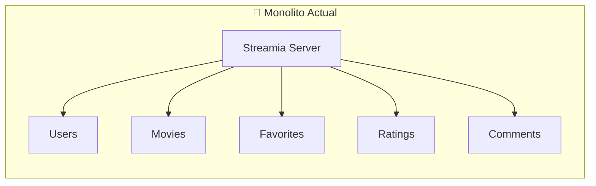

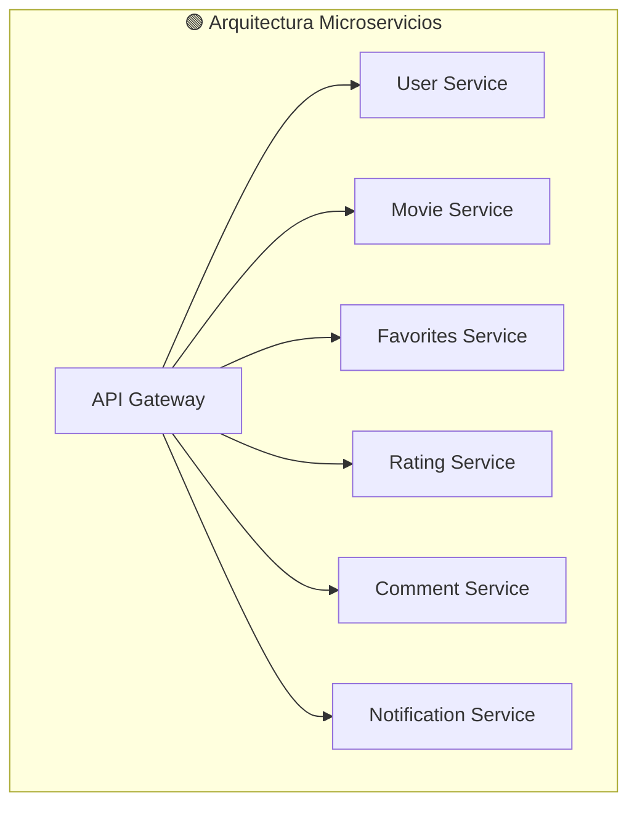

---

## Visión General de la Arquitectura

### Diagrama de Arquitectura Completa

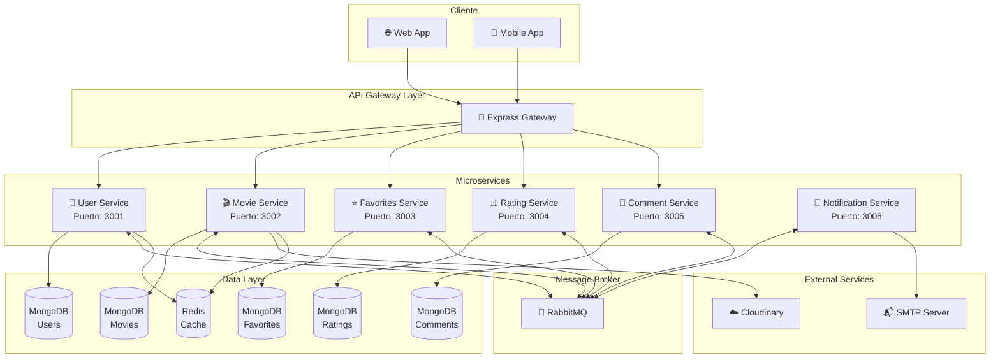

---

## Patrones de Diseño

### 1. 🔄 Saga Pattern (Requerido)

El patrón Saga maneja transacciones distribuidas que involucran múltiples microservicios, garantizando la consistencia eventual del sistema.

#### Justificación
- Las operaciones en Streamia involucran múltiples servicios (ej: eliminar usuario debe eliminar sus favoritos, ratings y comentarios)
- No podemos usar transacciones ACID tradicionales entre bases de datos separadas
- Necesitamos un mecanismo de compensación ante fallos

#### Saga: Eliminación de Usuario

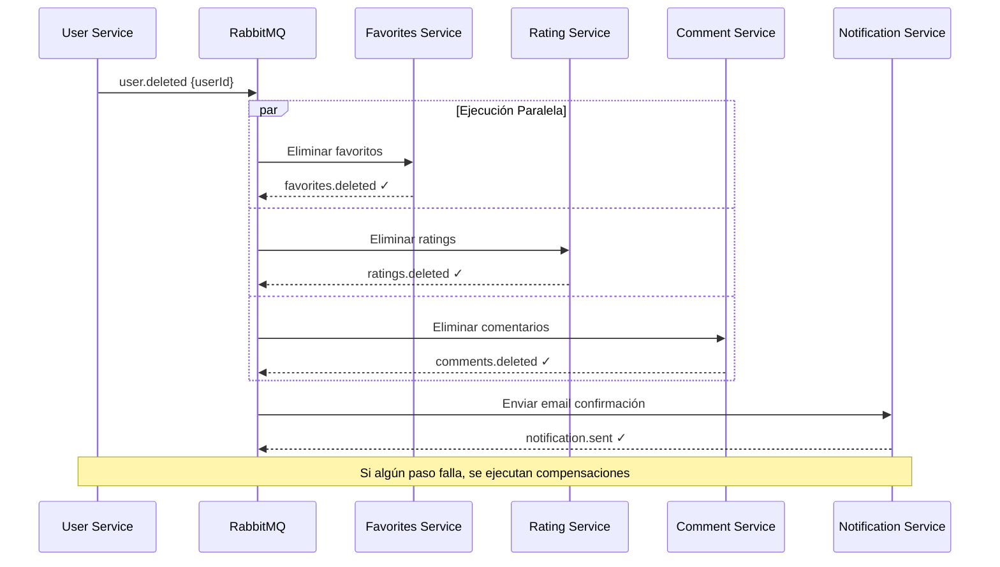

#### Saga: Eliminación de Película

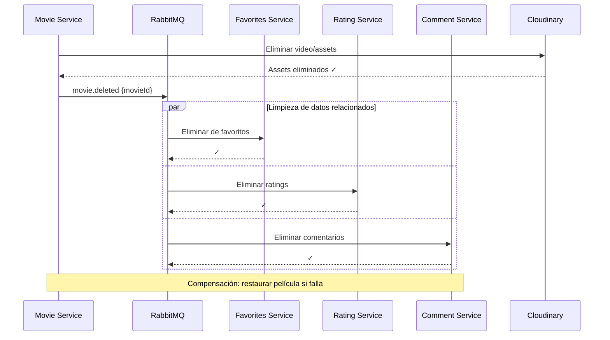

### 2. 🚪 API Gateway Pattern

Express Gateway actúa como punto de entrada único para todos los clientes.

#### Justificación
- Centraliza autenticación y autorización
- Simplifica la experiencia del cliente (una sola URL)
- Permite rate limiting, logging y transformación de requests
- Facilita el versionado de APIs

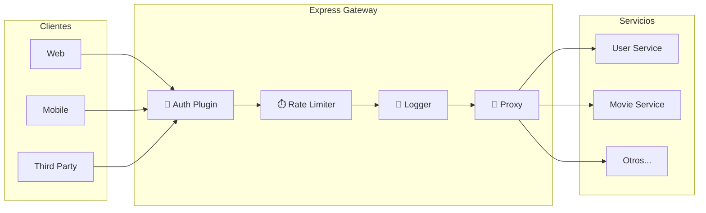

### 3. ⚡ Circuit Breaker Pattern

Previene fallos en cascada cuando un servicio no responde.

#### Justificación
- Evita que un servicio caído afecte a todo el sistema
- Permite recuperación gradual
- Mejora la experiencia del usuario con respuestas rápidas de error

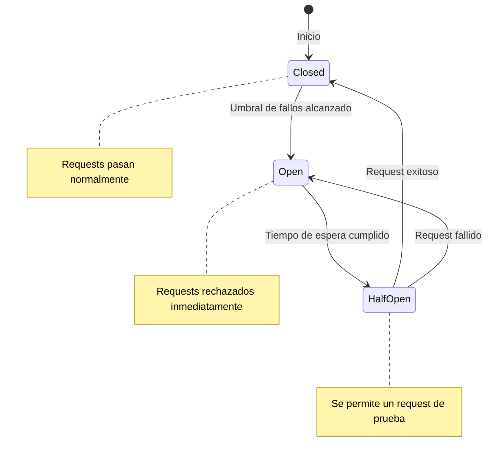

### 4. 📊 Database per Service Pattern

Cada microservicio tiene su propia base de datos.

#### Justificación
- Independencia total entre servicios
- Cada servicio puede elegir el tipo de BD más adecuado
- Facilita el escalado independiente
- Evita acoplamiento a nivel de datos

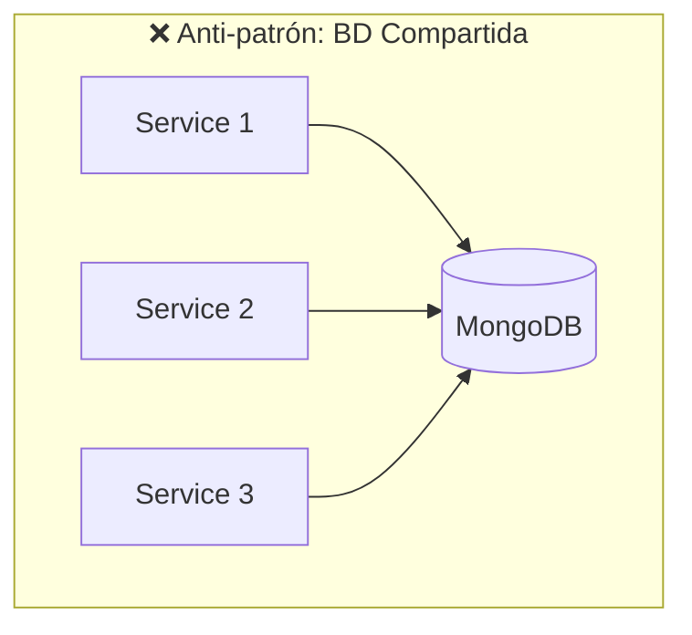

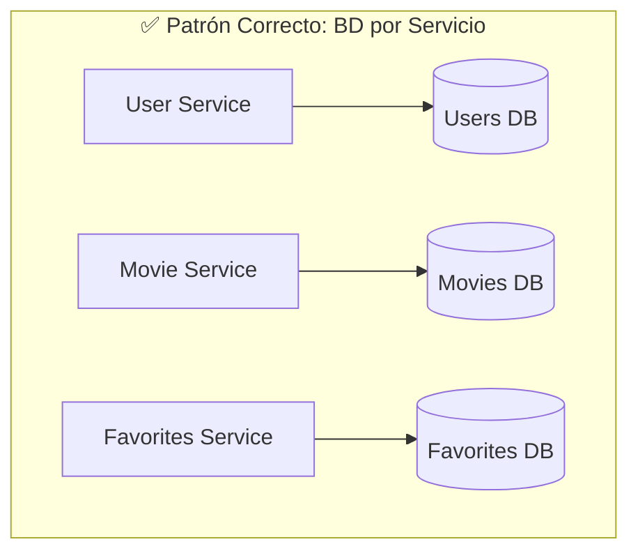

---

## Microservicios del Sistema

### Diagrama de Responsabilidades

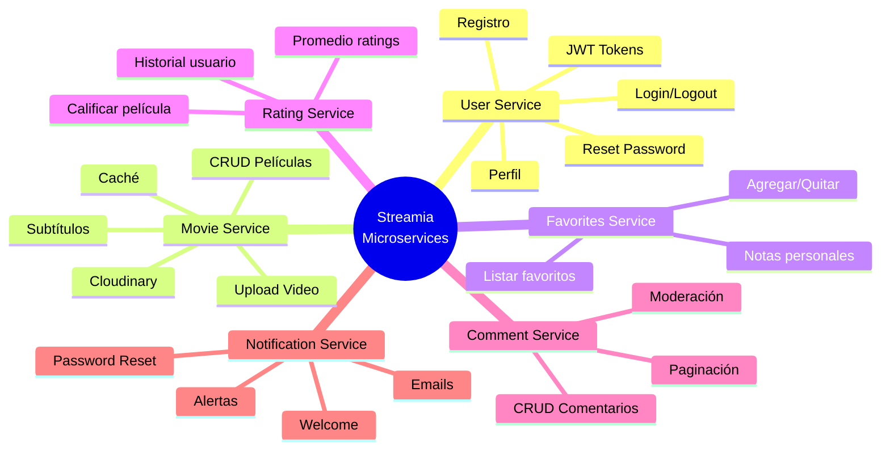

### Tabla de Microservicios

| Servicio | Puerto | Base de Datos | Responsabilidad Principal |
|----------|--------|---------------|---------------------------|
| **User Service** | 3001 | MongoDB (users) | Autenticación, gestión de usuarios, JWT |
| **Movie Service** | 3002 | MongoDB (movies) | Catálogo de películas, Cloudinary |
| **Favorites Service** | 3003 | MongoDB (favorites) | Lista de favoritos por usuario |
| **Rating Service** | 3004 | MongoDB (ratings) | Sistema de calificaciones |
| **Comment Service** | 3005 | MongoDB (comments) | Comentarios en películas |
| **Notification Service** | 3006 | - | Envío de emails y notificaciones |

### Detalle de Cada Servicio

#### 👤 User Service

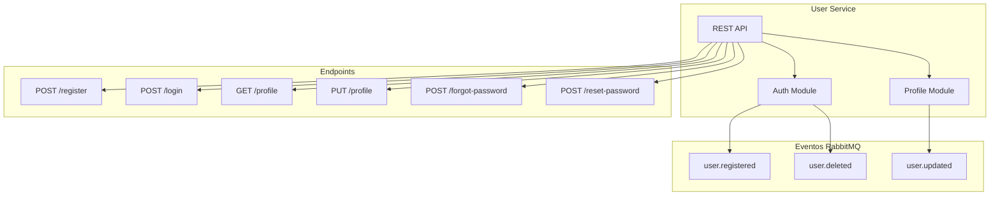

#### 🎬 Movie Service

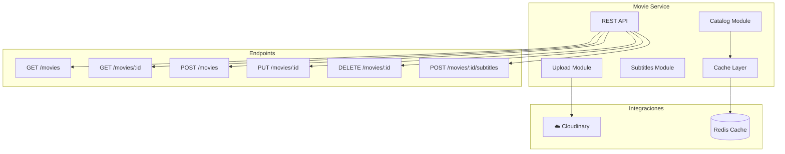

---

## Comunicación entre Servicios

### Choreography vs Orchestration

Este sistema utiliza **Choreography** (Coreografía) para la comunicación entre servicios.

#### ¿Por qué Choreography?

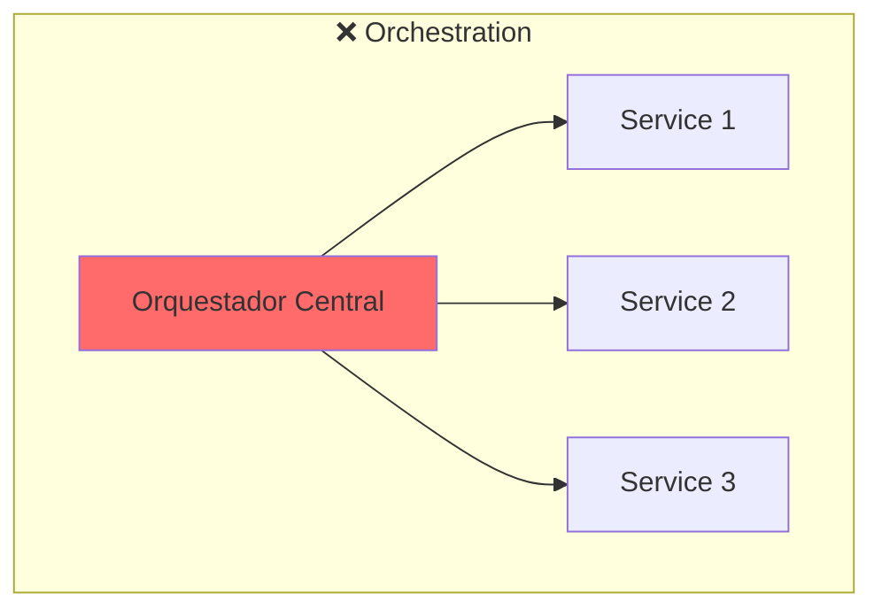

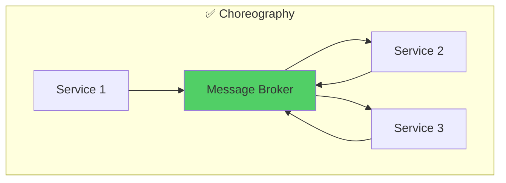

#### Justificación de Choreography

| Aspecto | Ventaja |
|---------|---------|
| **Desacoplamiento** | Los servicios no conocen a los demás, solo publican/consumen eventos |
| **Escalabilidad** | No hay punto central de fallo o cuello de botella |
| **Autonomía** | Cada servicio decide cómo reaccionar a los eventos |
| **Flexibilidad** | Fácil agregar nuevos consumidores sin modificar productores |
| **Resiliencia** | Si un servicio cae, los mensajes esperan en la cola |

#### Trade-offs

| Desventaja | Mitigación |
|------------|------------|
| Difícil rastrear flujos | Distributed tracing con Jaeger |
| Debugging complejo | Logging centralizado con ELK |
| Consistencia eventual | Diseño idempotente de handlers |

### Flujo de Eventos con RabbitMQ

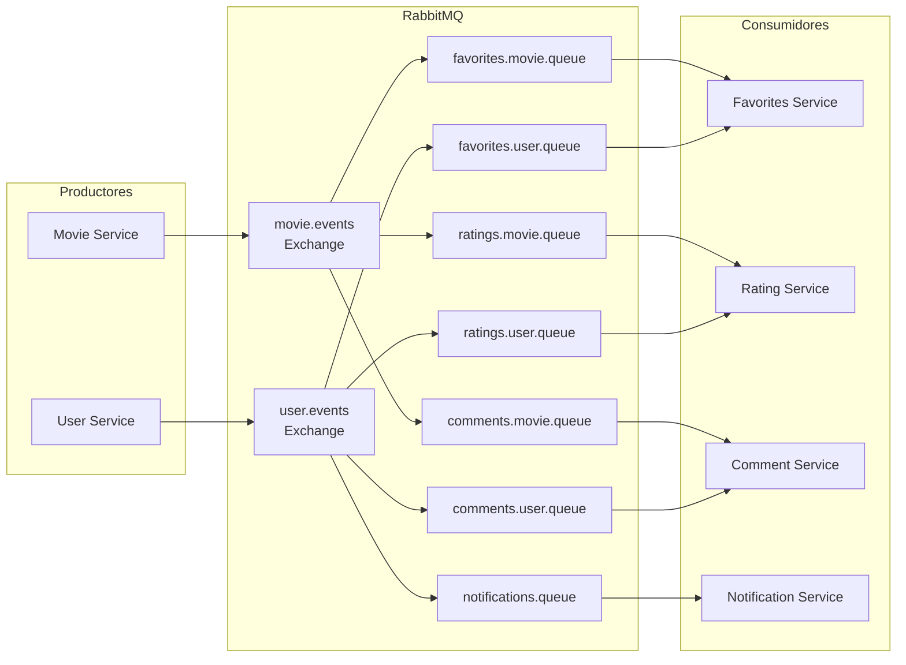

### Tipos de Comunicación

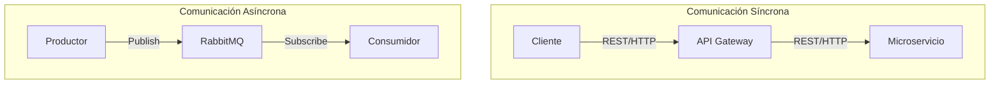

| Tipo | Uso | Ejemplo |
|------|-----|---------|
| **Síncrono (REST)** | Operaciones que requieren respuesta inmediata | GET /movies, POST /login |
| **Asíncrono (RabbitMQ)** | Eventos, notificaciones, operaciones en background | user.deleted, movie.uploaded |

---

## Infraestructura y Herramientas

### Stack Tecnológico

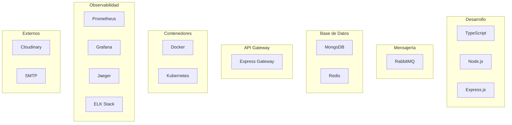

### Tabla de Herramientas

| Categoría | Herramienta | Propósito |
|-----------|-------------|-----------|
| **Backend** | Node.js + TypeScript + Express | Framework base para microservicios |
| **Message Broker** | RabbitMQ | Comunicación asíncrona entre servicios |
| **Base de Datos** | MongoDB | Almacenamiento principal de cada servicio |
| **Caché** | Redis | Caché distribuido, sesiones |
| **API Gateway** | Express Gateway | Punto de entrada, auth, rate limiting |
| **Contenedores** | Docker | Empaquetado de servicios |
| **Orquestación** | Kubernetes | Despliegue, escalado, self-healing |
| **Métricas** | Prometheus + Grafana | Monitoreo y dashboards |
| **Tracing** | Jaeger | Distributed tracing |
| **Logging** | ELK Stack | Logs centralizados |
| **Media** | Cloudinary | Almacenamiento de videos y assets |

---

## Testing y Monitoreo

### Estrategia de Testing

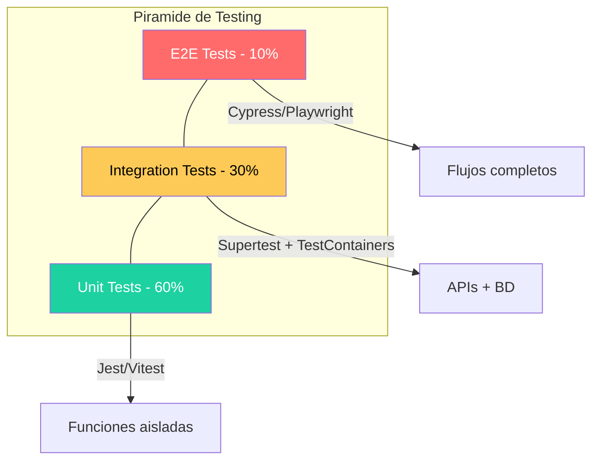

#### Tipos de Tests por Servicio

| Tipo | Herramienta | Qué Testea | Ejemplo |
|------|-------------|------------|---------|
| **Unit** | Jest/Vitest | Funciones, validadores, helpers | Validar email format |
| **Integration** | Supertest + TestContainers | APIs + Base de datos | POST /register guarda en BD |
| **Contract** | Pact | Contratos entre servicios | User Service → Notification Service |
| **E2E** | Playwright | Flujos completos del sistema | Registro → Login → Agregar favorito |

### Observabilidad

#### Los Tres Pilares

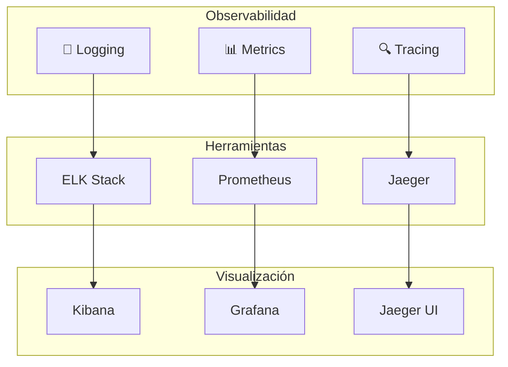

#### Flujo de Logs Centralizado

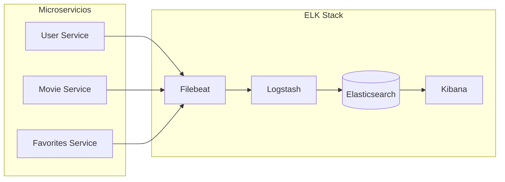

#### Métricas Clave

```mermaid
flowchart TB
    subgraph "Métricas por Servicio"
        REQ[Request Rate<br/>req/sec]
        LAT[Latency<br/>p50, p95, p99]
        ERR[Error Rate<br/>%]
        SAT[Saturation<br/>CPU, Memory]
    end

    subgraph "Métricas de Negocio"
        USERS[Usuarios registrados]
        MOVIES[Películas subidas]
        RATINGS[Ratings promedio]
    end
```

#### Distributed Tracing

```mermaid
sequenceDiagram
    participant C as Cliente
    participant GW as Gateway
    participant US as User Service
    participant FS as Favorites Service
    participant DB as MongoDB

    Note over C,DB: Trace ID: abc-123

    C->>GW: GET /favorites
    Note right of GW: Span 1
    GW->>US: Validate JWT
    Note right of US: Span 2
    US-->>GW: User valid
    GW->>FS: GET favorites
    Note right of FS: Span 3
    FS->>DB: Query
    Note right of DB: Span 4
    DB-->>FS: Results
    FS-->>GW: Favorites list
    GW-->>C: Response

    Note over C,DB: Jaeger muestra el trace completo
```

---

## Despliegue con Kubernetes

### Arquitectura de Despliegue

```mermaid
flowchart TB
    subgraph "Kubernetes Cluster"
        subgraph "Ingress"
            ING[Nginx Ingress]
        end

        subgraph "Services Namespace"
            subgraph "User Service Pod"
                US1[Container 1]
                US2[Container 2]
            end
            subgraph "Movie Service Pod"
                MS1[Container 1]
                MS2[Container 2]
            end
            subgraph "Otros Pods"
                OTHER[...]
            end
        end

        subgraph "Infrastructure Namespace"
            RMQ[RabbitMQ StatefulSet]
            REDIS[Redis StatefulSet]
            MONGO[MongoDB StatefulSet]
        end

        subgraph "Monitoring Namespace"
            PROM[Prometheus]
            GRAF[Grafana]
            JAEGER[Jaeger]
        end
    end

    INTERNET[🌐 Internet] --> ING
    ING --> US1 & US2 & MS1 & MS2
```

### Componentes de Kubernetes

```mermaid
flowchart LR
    subgraph "Por cada Microservicio"
        DEP[Deployment]
        SVC[Service]
        HPA[HorizontalPodAutoscaler]
        CM[ConfigMap]
        SEC[Secret]
    end

    DEP --> |"Gestiona"| POD[Pods]
    SVC --> |"Expone"| POD
    HPA --> |"Escala"| DEP
    CM --> |"Config"| POD
    SEC --> |"Secrets"| POD
```

### Estrategia de Escalado

```mermaid
flowchart TB
    subgraph "Auto Scaling"
        HPA[HPA - Horizontal Pod Autoscaler]
        
        HPA --> |"CPU > 70%"| SCALE_UP[Scale Up]
        HPA --> |"CPU < 30%"| SCALE_DOWN[Scale Down]
        
        SCALE_UP --> |"Max: 10 pods"| PODS1[Más réplicas]
        SCALE_DOWN --> |"Min: 2 pods"| PODS2[Menos réplicas]
    end
```

### Health Checks

```mermaid
flowchart LR
    subgraph "Health Probes"
        LP[Liveness Probe<br/>/health/live]
        RP[Readiness Probe<br/>/health/ready]
    end

    K8S[Kubernetes] --> LP
    K8S --> RP

    LP --> |"Falla"| RESTART[Reinicia Pod]
    RP --> |"Falla"| REMOVE[Quita del Service]
```

---

## Estructura de Carpetas del Proyecto

```
streamia-microservices/
├── services/
│   ├── user-service/
│   │   ├── src/
│   │   ├── Dockerfile
│   │   └── package.json
│   ├── movie-service/
│   │   ├── src/
│   │   ├── Dockerfile
│   │   └── package.json
│   ├── favorites-service/
│   │   ├── src/
│   │   ├── Dockerfile
│   │   └── package.json
│   ├── rating-service/
│   │   ├── src/
│   │   ├── Dockerfile
│   │   └── package.json
│   ├── comment-service/
│   │   ├── src/
│   │   ├── Dockerfile
│   │   └── package.json
│   └── notification-service/
│       ├── src/
│       ├── Dockerfile
│       └── package.json
├── gateway/
│   └── express-gateway/
│       ├── config/
│       │   ├── gateway.config.yml
│       │   └── system.config.yml
│       └── Dockerfile
├── infrastructure/
│   ├── docker-compose.yml
│   └── kubernetes/
│       ├── namespaces/
│       ├── services/
│       ├── deployments/
│       ├── configmaps/
│       └── secrets/
├── shared/
│   ├── events/
│   └── types/
└── docs/
    └── arquitectura-microservicios.md
```

---

## Resumen Visual

```mermaid
flowchart TB
    subgraph "🎯 Streamia Microservices"
        direction TB
        
        subgraph "Entrada"
            CLIENT[Clientes] --> GW[Express Gateway]
        end

        subgraph "Servicios"
            GW --> US[👤 Users]
            GW --> MS[🎬 Movies]
            GW --> FS[⭐ Favorites]
            GW --> RS[📊 Ratings]
            GW --> CS[💬 Comments]
        end

        subgraph "Eventos"
            US & MS & FS & RS & CS <--> RMQ[🐰 RabbitMQ]
            RMQ --> NS[📧 Notifications]
        end

        subgraph "Datos"
            US --> DB1[(MongoDB)]
            MS --> DB2[(MongoDB)]
            FS --> DB3[(MongoDB)]
            RS --> DB4[(MongoDB)]
            CS --> DB5[(MongoDB)]
            GW --> REDIS[(Redis)]
        end

        subgraph "Observabilidad"
            ALL[Todos los servicios] --> PROM[Prometheus]
            ALL --> ELK[ELK]
            ALL --> JAEGER[Jaeger]
        end
    end

    K8S[☸️ Kubernetes] --> |"Orquesta"| ALL
```

---


